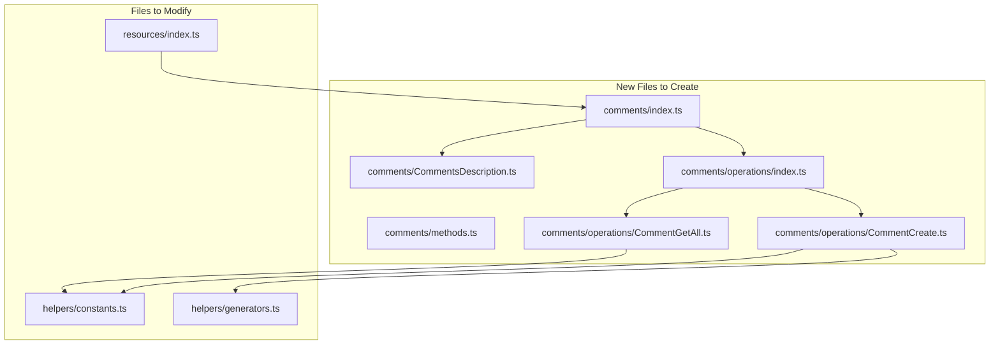

# Add Comment Resource to n8n-nodes-ticktick

## Architecture

The new Comment resource follows the exact same pattern as existing resources (e.g., `projectGroups`). It will be V2-only (Session API) and use the existing `tickTickApiRequestV2` helper.




## API Endpoints

Both operations use the V2 API (prefix handled by `tickTickApiRequestV2`):

- **Get All Comments**: `GET /project/{projectId}/task/{taskId}/comments`
- **Create Comment**: `POST /project/{projectId}/task/{taskId}/comment`

## Step 1: Add endpoints and generator

**[helpers/constants.ts](nodes/TickTick/helpers/constants.ts)** -- add two new endpoint functions:

```typescript
TASK_COMMENTS: (projectId: string, taskId: string) =>
    `/project/${validatePathParam(projectId, "projectId")}/task/${validatePathParam(taskId, "taskId")}/comments`,
TASK_COMMENT: (projectId: string, taskId: string) =>
    `/project/${validatePathParam(projectId, "projectId")}/task/${validatePathParam(taskId, "taskId")}/comment`,
```

**[helpers/generators.ts](nodes/TickTick/helpers/generators.ts)** -- add:

```typescript
export function generateCommentId(): string {
    return generateId(24);
}
```

## Step 2: Create Comment resource files

All files go under `nodes/TickTick/resources/comments/`.

### `operations/CommentGetAll.ts`

- Fields: `projectId` (resourceLocator with `searchListMethod: "searchProjects"`) and `taskId` (resourceLocator with `searchListMethod: "searchTasks"`) -- same pattern as existing task operations
- Execute: calls `tickTickApiRequestV2(this, "GET", ENDPOINTS.TASK_COMMENTS(projectId, taskId))`
- Returns the array of comment objects, each wrapped in `{ json: comment }`

### `operations/CommentCreate.ts`

- Fields: `projectId`, `taskId` (same resourceLocators), plus `title` (string, required) for the comment text
- Execute: generates `id` via `generateCommentId()`, generates `createdTime` in ISO format (`new Date().toISOString()` adjusted to `+0000` format), builds payload:

```typescript
{
    id: generateCommentId(),
    projectId,
    taskId,
    title,
    createdTime: formatTickTickDate(new Date()),
    isNew: true,
    userProfile: { isMyself: true },
}
```

- POST returns empty body, so we return the constructed payload as the output item

### `CommentsDescription.ts`

- V2-only notice (same pattern as projectGroups -- shown when non-Session auth is selected)
- Operation dropdown with "Get All" and "Create" options
- Spreads field arrays from both operations

### `methods.ts`

- Wire up `listSearch` methods for `searchProjects` and `searchTasks` (reuse existing functions from [helpers/loadOptions.ts](nodes/TickTick/helpers/loadOptions.ts))

### `operations/index.ts` and `index.ts`

- Standard barrel exports following the projectGroups pattern
- `ResourceDefinition` with `name: "comment"`, handlers for `getAll` and `create`

## Step 3: Register the resource

**[resources/index.ts](nodes/TickTick/resources/index.ts)** -- add:

```typescript
import { commentResource } from "./comments";
registry.register(commentResource);
export { commentResource } from "./comments";
```

## Step 4: Build and verify

```bash
npm run build
```

Confirm no TypeScript errors. The new "Comment" resource should appear in the resource dropdown when Session API auth is selected.

## Step 5: Deploy to Docker on DigitalOcean

n8n in Docker loads custom community nodes from a persistent volume. The standard approach:

1. SSH into the DigitalOcean droplet
2. Enter the n8n container or use the mounted data volume
3. Install the fork from GitHub into n8n's node_modules:

```bash
cd /home/node/.n8n
npm install botechos/n8n-nodes-ticktick
```

1. Restart the n8n container -- the node will be picked up automatically

If n8n uses `N8N_CUSTOM_EXTENSIONS` or `EXTRA_PACKAGES` env vars, those can also be configured to pull the fork.

## File Summary


| Action | File                                                             |
| ------ | ---------------------------------------------------------------- |
| Modify | `nodes/TickTick/helpers/constants.ts` (add 2 endpoints)          |
| Modify | `nodes/TickTick/helpers/generators.ts` (add `generateCommentId`) |
| Create | `nodes/TickTick/resources/comments/index.ts`                     |
| Create | `nodes/TickTick/resources/comments/CommentsDescription.ts`       |
| Create | `nodes/TickTick/resources/comments/methods.ts`                   |
| Create | `nodes/TickTick/resources/comments/operations/index.ts`          |
| Create | `nodes/TickTick/resources/comments/operations/CommentGetAll.ts`  |
| Create | `nodes/TickTick/resources/comments/operations/CommentCreate.ts`  |
| Modify | `nodes/TickTick/resources/index.ts` (register new resource)      |


